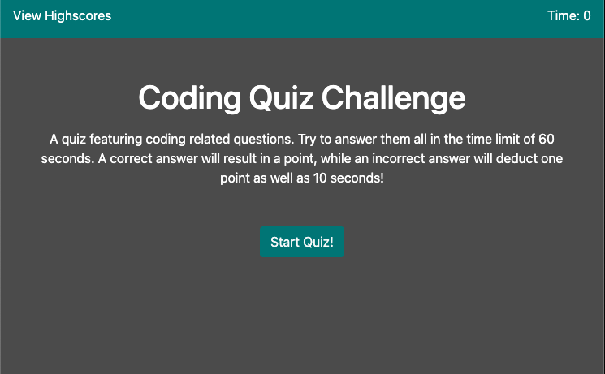

# Code-Quiz

A web hosted quiz generated with html, css, and JS.

The quiz consists of 5 general coding questions that are timed and gives one point per correct answer. You have a total of 60 seconds to attempt the quiz. Incorrect answers will deduct 1 point as well as 10 seconds from the timer. The quiz will end after answering all 5 questions or the timer reaches 0. After the timer expires, you will be kicked out of the quiz and your score calculated. Enter your username and see the high scores!

Uses localStorage to save highscores.

https://nmp14.github.io/Code-Quiz/

